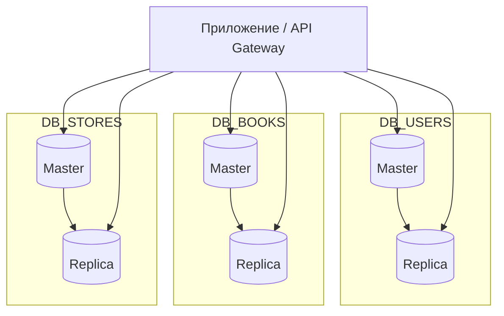
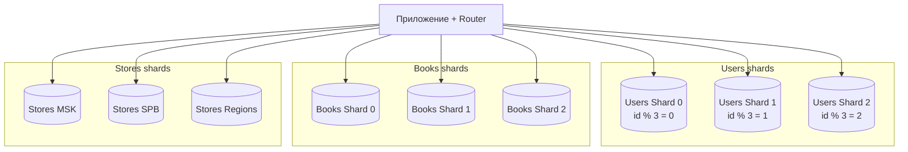
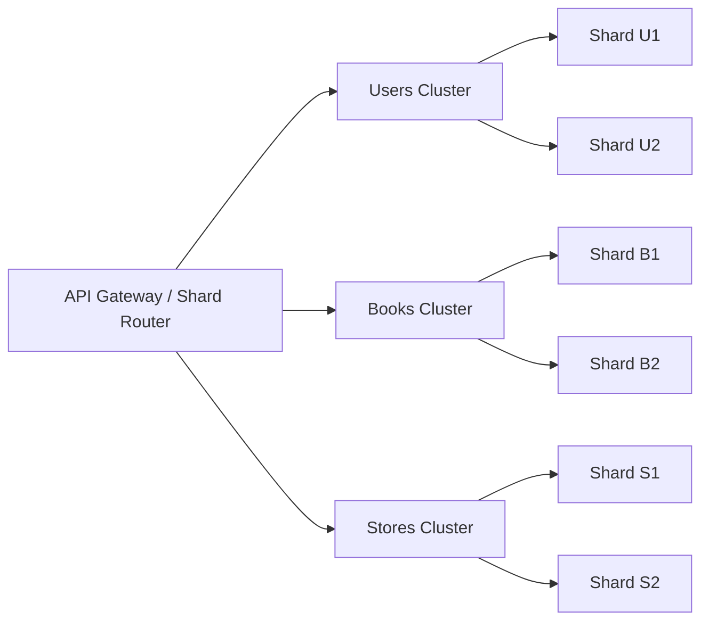

# 📈 Домашнее задание 12.07: Репликация и масштабирование. Часть 2

**Выполнил:** Сыч Кирилл  
**Группа:** SFLT-58  
**Дата:** 20 сентября 2026

[](https://www.postgresql.org/docs/current/high-availability.html)
[](https://github.com/netology-code/sdb-homeworks/blob/main/12-07.md)

---

## 📋 Содержание

- [Контекст](#-контекст)
- [Задание 1: Преимущества репликации](#-задание-1-преимущества-репликации)
- [Задание 2: План шардинга](#-задание-2-план-шардинга)
- [Push на GitHub](#-push-на-github)

---

## 📌 Контекст

Рассматривается система **интернет-магазина книг** с тремя основными сущностями:

| Таблица | Назначение | Примерные поля |
|---------|------------|----------------|
| `users` | покупатели | `user_id`, `name`, `email`, `city`, `created_at` |
| `books` | каталог книг | `book_id`, `title`, `author`, `price`, `rating`, `genre` |
| `stores` | магазины и остатки | `store_id`, `name`, `city`, `book_id`, `stock` |

Связи: пользователь покупает книги в магазинах; один магазин продаёт много книг, один пользователь может покупать в разных магазинах.

---

## 🎯 Задание 1: Преимущества репликации

### 1.1 Активный master и пассивный slave

**Схема:** все записи (`INSERT`, `UPDATE`, `DELETE`) идут только на **master**. **Slave** получает изменения через репликацию и используется как резервная копия или для чтения после переключения.

| Преимущество | Пояснение |
|--------------|-----------|
| **Отказоустойчивость** | при падении master можно выполнить failover на slave с актуальной (или почти актуальной) копией данных |
| **Резервное копирование** | slave можно использовать для backup/snapshot без нагрузки на master |
| **Простота модели** | один источник записи — нет конфликтов записи между узлами |
| **Восстановление после сбоя** | быстрее поднять slave, чем восстанавливать master «с нуля» |

**Ограничения:**

- slave в пассивном режиме не снимает нагрузку чтения, пока не начнёт обслуживать запросы;
- при **асинхронной** репликации возможна потеря последних транзакций после аварии;
- при **синхронной** репликации растёт задержка записи.

---

### 1.2 Master и несколько slave-серверов

**Схема:** один **master** для записи, несколько **slave** для чтения и резервирования.

| Преимущество | Пояснение |
|--------------|-----------|
| **Масштабирование чтения** | SELECT-запросы распределяются между slave (каталог книг, поиск, отчёты) |
| **Разделение нагрузки** | аналитика и тяжёлые отчёты выносятся на отдельный slave |
| **Выше доступность** | падение одного slave не останавливает систему |
| **Географическое распределение** | slave можно разместить ближе к пользователям (региональные DC) |

**Пример для магазина книг:**

- **master** — оформление заказов, изменение остатков;
- **slave-1** — поиск и карточки книг для сайта;
- **slave-2** — отчёты для бухгалтерии;
- **slave-3** — hot standby для failover.

**Ограничения:**

- запись по-прежнему ограничена одним master;
- slave могут отставать от master (replication lag);
- failover требует автоматизации (Patroni, repmgr и т.п.).

---

## 🎯 Задание 2: План шардинга

### 2.1 Вертикальный шардинг

**Идея:** разнести **разные таблицы** по разным серверам/базам — по доменам данных.

| База | Таблицы | Нагрузка |
|------|---------|----------|
| **DB_USERS** | `users` | регистрация, профили, авторизация |
| **DB_BOOKS** | `books` | каталог, поиск, фильтры |
| **DB_STORES** | `stores`, `store_books` | остатки, магазины, наличие |

**Принципы:**

1. Каждая БД масштабируется независимо.
2. JOIN между таблицами разных БД выполняется на уровне приложения или через API.
3. На каждой БД — **master + 1–2 read-replica** для чтения.



| Сервер | Режим | Роль |
|--------|-------|------|
| DB_USERS master | read/write | запись пользователей |
| DB_USERS replica | read only | профиль, авторизация |
| DB_BOOKS master | read/write | обновление каталога |
| DB_BOOKS replica | read only | поиск книг |
| DB_STORES master | read/write | остатки, магазины |
| DB_STORES replica | read only | проверка наличия |

---

### 2.2 Горизонтальный шардинг

**Идея:** одну таблицу **делим на части** (шарды) и разносим по серверам.

| Таблица | Ключ шардинга | Правило |
|---------|---------------|---------|
| `users` | `user_id` | `shard = user_id % 3` → 3 шарда |
| `books` | `book_id` | `shard = book_id % 3` → 3 шарда |
| `stores` | `city` | шард по региону: `Moscow`, `SPB`, `Other` |

**Принципы:**

1. Равномерное распределение данных по ключу.
2. Запросы без ключа шарда идут во **все** шарды (дорого) — их минимизируем.
3. На каждом шарде — **master + replica** (шард + репликация).



| Шард | Диапазон / правило | Режим |
|------|--------------------|-------|
| Users 0–2 | `user_id % 3` | master + read replica |
| Books 0–2 | `book_id % 3` | master + read replica |
| Stores MSK/SPB/REG | по городу | master + read replica |

---

### 2.3 Комбинированная схема (вертикаль + горизонталь)

На практике используют **оба подхода**:

1. **Вертикально** — разделить `users`, `books`, `stores` на разные кластеры.
2. **Горизонтально** — внутри каждого кластера делить таблицу на шарды при росте объёма.



**Маршрутизация в приложении:**

```python
def users_db(user_id: int) -> str:
    return f"users_shard_{user_id % 2}"

def books_db(book_id: int) -> str:
    return f"books_shard_{book_id % 2}"

def stores_db(city: str) -> str:
    if city == "Moscow":
        return "stores_msk"
    if city == "Saint Petersburg":
        return "stores_spb"
    return "stores_regions"
```

---

### 2.4 Разграничение ответственности

| Операция | Где выполняется |
|----------|-----------------|
| Регистрация пользователя | `DB_USERS` / users shard |
| Поиск книги по жанру | `DB_BOOKS` replica или books shard |
| Проверка наличия в магазине | `DB_STORES` / stores shard по городу |
| Оформление заказа | транзакция в приложении: users + stores + books |
| Аналитика | отдельные read-replica, без нагрузки на master |

---

### 📸 Блок-схема (скриншот)


> Mermaid-диаграммы выше рендерятся на GitHub. Дополнительно можно сохранить скриншот схемы в `screenshots/task2-sharding-diagram.png`.

---

## 📚 Источники

- [PostgreSQL — High Availability](https://www.postgresql.org/docs/current/high-availability.html)

